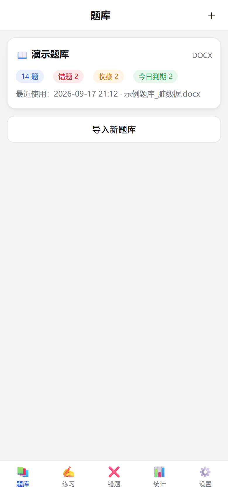
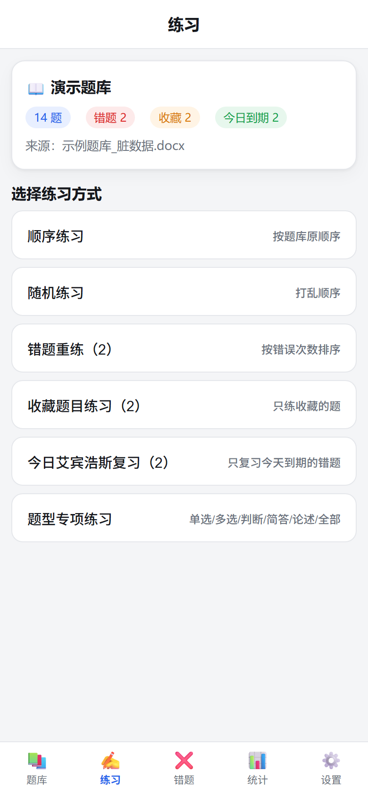
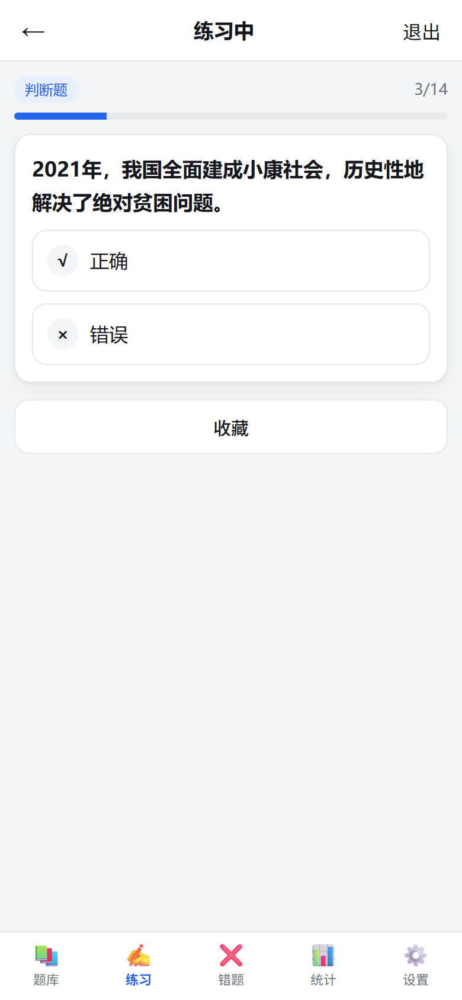
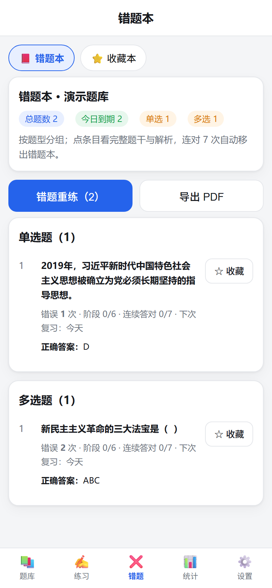
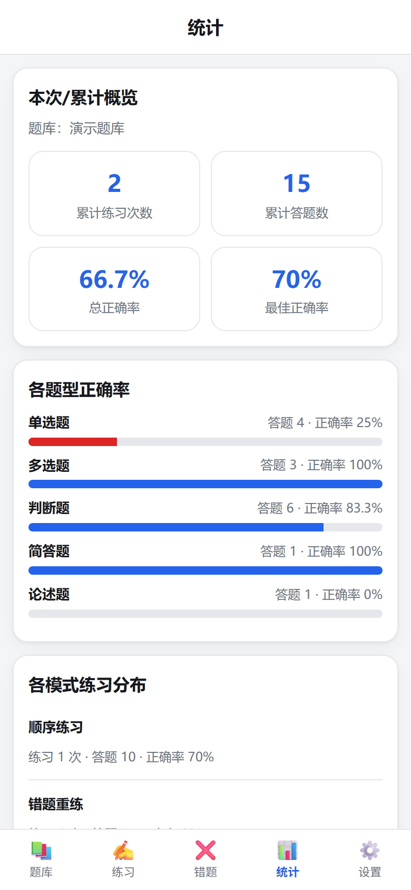

# 刷题助手（手机版）📱

把 **.docx / .pdf 题库**变成手机上的刷题 App：顺序/随机/错题/收藏/艾宾浩斯复习/题型专项练习，错题本、收藏本、统计、解析日志、手动补录、导出 PDF 一应俱全，**完全离线运行，不联网、不上传任何数据**。

仓库自带 GitHub Actions 工作流：**推代码 → 云端自动构建 → 下载 APK 安装**，不需要本地装 Android SDK。

## 📥 直接下载安装（已构建好的 APK）

| 版本 | 说明 | 下载 |
| --- | --- | --- |
| `app-release.apk`（6.0 MB） | **推荐**，v1.0.4 | [Release 页面](https://github.com/ham293/quiz-mobile/releases/latest) 或 [直接下载](https://github.com/ham293/quiz-mobile/releases/download/v1.0.4/app-release.apk) |
| `app-debug.apk`（7.1 MB） | 带调试信息，装不上时换这个试试 | [直接下载](https://github.com/ham293/quiz-mobile/releases/download/v1.0.4/app-debug.apk) |

> **手机网络打不开 github.com 下载链接时**（国内常见），在下载地址前面加一个加速前缀即可，例如：
> `https://ghproxy.net/https://github.com/ham293/quiz-mobile/releases/download/v1.0.4/app-release.apk`
> （`https://ghfast.top/`、`https://gh-proxy.com/` 效果相同，哪个通用哪个）
> 也可以去仓库的 **Actions → 最新一次运行 → Artifacts** 下载 `刷题助手-APK`。

安装步骤：手机浏览器下载 → 点开 APK → 系统提示「未知来源」时允许安装（小米/华为/OPPO 的入口在「设置 → 应用 → 特殊权限」里）→ 桌面出现「刷题助手」。
历次版本用的是同一把签名密钥，可以直接**覆盖安装升级**，不会丢题库数据。

### 导入失败怎么办

1. 先在首页点 **「导入示例题库」**：示例能导进来 → 程序没问题，是个别文件的格式/内容问题；示例也失败 → 把报错发我。
2. 报错弹窗里现在会带上**真实错误信息**（错误名、文件大小、可能原因），直接截图发出来即可定位。
3. 最常见的两种原因：
   - **文件只读到一半**：从微信 / QQ / 网盘里直接选文件时经常这样。先「用其他应用打开 → 保存到手机文件」，再从本地导入。
   - **PDF 被加密或限制编辑**：先用 WPS / Adobe 去掉密码或权限限制（另存为一份新 PDF）再导入。


<p align="center">
  
  
  
  
  
</p>

---

## 一、自己重新构建（推送即构建）

1. **推送到 GitHub**（推到 `main` 分支会自动触发构建）：
   ```bash
   git push origin main
   ```
2. **等云构建**：打开仓库页面的 **Actions → 构建 APK**，约 5～10 分钟（首次会久一些）。
3. **下载安装**：
   - 日常做法：进 **Actions** → 点最新一次运行 → 页面底部 **Artifacts** → 下载 `刷题助手-APK`（zip 里是 `app-debug.apk` / `app-release.apk`）。
   - 更方便的做法：打 tag 并推送，工作流会把 APK 直接发布到 **Releases**（本项目已发布 v1.0.4）：
     ```bash
     git tag v1.0.1 && git push origin v1.0.1
     ```
   - 手机首次安装需要允许「安装未知来源应用」（系统会弹提示，跟着点即可）。

> 也可以手动触发：**Actions → 构建 APK → Run workflow**。

---

## 二、手机上的功能

| 功能 | 说明 |
| --- | --- |
| 导入题库 | 点右上角「＋」，从手机文件里选 `.docx` / 文字版 `.pdf` / `.txt`；`.doc` 会提示先另存为 `.docx`，扫描版 PDF 会提示不支持 OCR |
| 练习模式 | 顺序、随机、错题重练（按错误次数排序）、收藏题目、今日艾宾浩斯复习、题型专项（不分类顺序 / 不分类随机 / **按时间顺序**：题干年份升序、无年份放最后） |
| 答题交互 | 单选/判断**点选项即判定**，多选可多选后提交，简答/论述先看参考答案再自评「我会了 / 我不会」；作答后立刻显示对错、正确答案与解析 |
| 错题本 | 答错自动入库，记录错误次数、连续答对、复习阶段、下次复习日期；**连续答对 7 次自动移出**；按题型分组展示；一键错题重练 |
| 艾宾浩斯 | 间隔 `[0, 1, 2, 4, 7, 15, 30]` 天；答错回到阶段 0（当天复习），答对推进一阶段；首页提示今日到期数量 |
| 收藏本 | 刷题时点「收藏」，按题型分组，可只练收藏题（收藏练习里答错照样进错题本） |
| 统计 | 本次练习报告（答题数/正确数/正确率/答错列表/薄弱知识点）+ 累计统计（练习次数、总正确率、最佳正确率、各题型正确率、各模式分布、最近 20 次） |
| 手动补录 | 解析异常或识别不准的题，可在「设置 → 手动补录」里按表单补录；按题干去重，与自动解析题完全平权 |
| **知识点自动出题** | 上传知识点 / 复习资料（docx / pdf / txt，或直接粘贴文本），用**规则离线生成**填空题、选择题、判断题，每题都带参考答案与出处原句；生成结果直接存成一个新题库，可练习、进错题本、参与统计 |
| 解析日志 | 记录每一条解析异常（时间/页码/行号/原因/原始题目全文）与被跳过的噪声行（页眉页脚、页码、推广语、章节标题） |
| 导出 PDF | 错题本 / 收藏本导出成 PDF（中文正常），保存到手机「文档」目录并唤起系统分享 |
| 多题库 | 每个题库独立的错题本、收藏本、统计、日志、补录，互不影响 |

截图见 `docs/screenshots/`。

---

## 三、题库文件怎么被解析

解析规则与桌面版《刷题程序》完全一致（同一套规则在两处实现，已对拍验证 JSON 输出一致）：

- **切题**：`1.` `1、` `1）` `第3题` `(4)` `1．` 阿拉伯/中文数字编号，以及 `【单选题】` 行首题型标记
- **题型**：显式标记 > 判断题特征（答案为 正确/错误/√/×，或选项 A.正确 B.错误）> 选项数 ≥2（答案 ≥2 字母为多选）> 论述特征词 / 简答
- **答案**：题干括号内 `（D）` `(ABC)` `（√）`；独立行 `答案：D` / `参考答案：ABC` / `【答案】D`；与最后一个选项同行结尾
- **解析**：`解析：` `答案解析：` `【解析】` `分析：` `解答：`，多行累计
- **噪声清理**：页码行、页眉页脚推广语（「全部资料电子版在公众号…」）、分隔线、章节标题行
- **选项容错**：分行选项、一行挤在一起 `A.新思想B.新举措…`、选项跨行续行，`CAD`/`GDP增长` 这类正文不会被误切
- **溯源**：PDF 记录「第几页第几行」，Word 记录段落序号，导出的题目和日志里都能看到

---

## 四、本地开发与测试

不需要 Android 环境即可开发界面：`web/` 是纯静态页面，直接起个本地服务器就能在浏览器里用。

```bash
npm ci                  # 安装依赖
npm run vendor          # 把 mammoth / pdf.js / jsPDF / html2canvas 拷进 web/vendor（离线用）
npm test                # 67 项单元 + 全链路测试
python -m http.server 8765    # 然后浏览器打开 http://127.0.0.1:8765/web/index.html
```

本地要打 APK（可选，需要 JDK 21 + Android SDK）：

```bash
npx cap add android     # 生成安卓工程
node scripts/patch-android.mjs   # 注入稳定签名 + 拨入 App 图标
npx cap sync android
cd android && ./gradlew assembleDebug
```

### 测试与验证

| 内容 | 结果 |
| --- | --- |
| `npm test`（67 项） | 全部通过：模型/答案判定/艾宾浩斯/统计/题库隔离、解析规则 25 个用例、导出 HTML 20 个用例、docx 全链路（68 行 → 14 题）、PDF 全链路（2 页 → 页码行号）、导入→练习→错题本→统计端到端 |
| 浏览器端自测（headless Chrome，真实渲染） | 28 项全通过：应用启动、docx 真实解析、练习作答反馈、「下一题」、9 个页面渲染无异常、练习报告、**真实导出 PDF（115 KB）**、IndexedDB 落盘、艾宾浩斯到期 |
| 界面截图 | `docs/screenshots/` 11 张（题库/练习/答题/报告/错题/收藏/统计/日志/补录/设置/关于） |
| 与桌面版对拍 | 同一份样本，Python 版与 JS 版解析出的 questions/skipped/errors 结构完全一致 |
| 已构建 APK 校验 | 下载 Release 里的 `app-release.apk` 逐个核对：659 个文件、`assets/public/**` 前端资源与 vendor 离线库全部就位、`classes.dex`/`resources.arsc`/`AndroidManifest.xml` 齐全、包名 `com.ham293.quizmobile`、**APK Signature Scheme v2/v3 与 v1 签名均存在且证书为本仓库的密钥库**（保证可覆盖升级） |

自动化测试文件：`tests/core.test.mjs`、`tests/parser-text.test.mjs`、`tests/exporter.test.mjs`、`tests/pipeline.test.mjs`；浏览器自测页 `tests/browser-selftest.html`、截图工具 `tests/shoot.mjs`。

---

## 五、项目结构

```
web/                     打包进 APK 的全部前端资源（无构建步骤）
  index.html
  css/app.css
  js/
    app.js               路由、全局状态、导入流程
    db.js                IndexedDB 封装（Node 下自动降级为内存实现，便于测试）
    models.js            题目模型、答案判定、年份/知识点提取
    parser-text.js       文本行 → 题目（切题/答案/选项/噪声/日志）
    extract.js           docx(mammoth) / pdf(pdf.js) / txt → 文本行
    bank.js              题库仓库：错题本、收藏本、统计、日志、手动补录
    ebbinghaus.js        艾宾浩斯调度
    stats.js             练习统计
    practice.js          取题与判定逻辑
    exporter.js          导出 PDF（html2canvas + jsPDF，中文不乱码）
    ui/*.js              各页面
  vendor/                第三方库（由 npm run vendor 生成，不入库）
tests/                   node:test 测试 + 浏览器自测页
scripts/
  copy-vendor.mjs        拷贝离线依赖
  patch-android.mjs      注入稳定签名与 App 图标
keystore/                侧载用自签名密钥库（保证每次构建签名一致，可覆盖升级）
resources/android/       安卓启动图标各分辨率
assets/                  PWA 图标与启动图
.github/workflows/build-apk.yml   GitHub Actions 构建 APK
```

### 关于签名

仓库里的 `keystore/quiz-release.p12` 是**自签名**密钥库（口令公开写在脚本里），作用是让每次都签同一把钥匙 —— 否则 CI 每次生成的默认调试签名都不同，新 APK 会因签名不一致**无法覆盖安装**（只能卸载重装，本地数据会丢）。它只适合个人侧载，**不要用它上架任何应用市场**。想换成自己的密钥，用 Android Studio 生成一个 keystore 替换该文件并修改 `scripts/patch-android.mjs` 里的口令即可。

---

## 六、常见问题

- **导入后 0 题**：多半是扫描版 PDF（图片版），App 不做 OCR；请换文字版 PDF 或 docx。
- **解析有几题不准**：去「设置 → 解析日志」看哪几行被跳过、哪几题报错，用「手动补录」补齐；补录题下次重新解析会自动保留。
- **App 数据在哪**：存在手机本地 IndexedDB，卸载 App 会清除。建议定期用「导出错题本 PDF」做备份。
- **构建失败**：到 Actions 里点开失败的那一步看日志；工作流已内置「签名配置失败 → 自动回退默认 debug 签名」的兜底，多数情况仍能拿到 APK。
- **手机安装被拦**：设置里允许「未知来源应用安装」（小米/华为/OPPO 等叫法略有不同），或把 APK 用文件管理器打开再点安装。

---

完全离线使用：题库、错题本、统计全部存在手机本地，应用内没有任何上传/同步逻辑，也不需要注册登录。安装包由 GitHub Actions 构建，源码和构建过程都在你自己的仓库里，随时可查。
